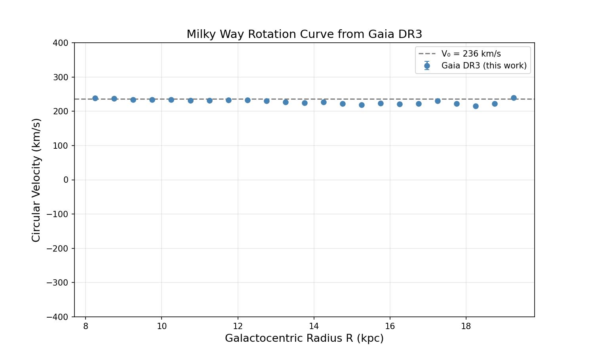

# Milky Way Rotation Curve from Gaia DR3

## Overview
Reconstructed the Milky Way's rotation curve using astrometric and radial velocity data from the Gaia Data Release 3 (DR3) catalog. The rotation curve measures how fast stars orbit the galactic center as a function of their distance from it — its flatness at large radii is one of the key observational signatures of dark matter.

## Data
- **Source:** Gaia DR3 via ESA's TAP service
- **Sample:** 50,000 disk stars selected with the following cuts:
  - Galactic latitude |b| < 10° (disk stars only)
  - Parallax S/N > 5
  - G-band magnitude < 14
  - Radial velocity available

## Method
1. Queried Gaia DR3 using ADQL via `astroquery`
2. Converted parallax to distance and transformed coordinates to the Galactocentric frame using `astropy`, adopting R₀ = 8.15 kpc and V₀ = 236 km/s
3. Extracted azimuthal velocities (v_phi) for each star
4. Binned by galactocentric radius and computed median velocities

## Result

The curve remains flat at ~220–240 km/s from 8 to 20 kpc, consistent with published results (Eilers et al. 2019).

## Tools
Python, astropy, astroquery, numpy, matplotlib, scipy

## Reference
Eilers et al. 2019, ApJ, 871, 120
